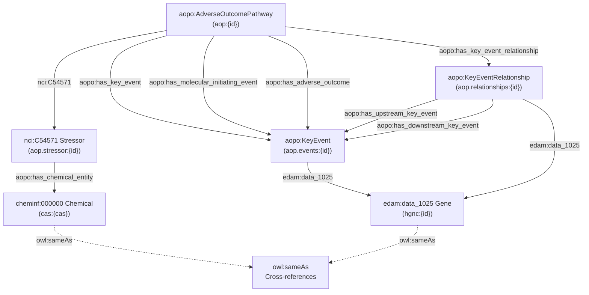

# AOP-Wiki RDF Schema Reference

This document describes the RDF schema used by the AOPWikiRDF dataset, including all entity types, their properties, namespace prefixes, and the relationships between entities.

## Overview

The AOPWikiRDF dataset represents Adverse Outcome Pathways (AOPs) from the [AOP-Wiki](https://aopwiki.org) in RDF/Turtle format. The dataset is split across four output files:

| File | Description |
|------|-------------|
| `AOPWikiRDF.ttl` | Core entity data: AOPs, Key Events, Key Event Relationships, Stressors, Chemicals, Taxonomies, Biological Events, and mapped gene/chemical identifiers |
| `AOPWikiRDF-Genes.ttl` | Gene association triples linking Key Events and KERs to genes found in their description text |
| `AOPWikiRDF-Enriched.ttl` | Cross-reference triples (`owl:sameAs`) linking chemicals and biological objects to external database identifiers |
| `AOPWikiRDF-Void.ttl` | VoID metadata describing the dataset, its subsets, provenance, and linksets |

Together these files provide a complete semantic web representation of AOP-Wiki content with enriched cross-references to external databases.

## Namespace Prefixes

### Core AOP Namespaces

| Prefix | URI | Usage |
|--------|-----|-------|
| `aop` | `https://identifiers.org/aop/` | AOP identifiers (e.g., `aop:1`) |
| `aop.events` | `https://identifiers.org/aop.events/` | Key Event identifiers (e.g., `aop.events:1`) |
| `aop.relationships` | `https://identifiers.org/aop.relationships/` | KER identifiers (e.g., `aop.relationships:1`) |
| `aop.stressor` | `https://identifiers.org/aop.stressor/` | Stressor identifiers |
| `aopo` | `http://aopkb.org/aop_ontology#` | AOP Ontology terms (entity types, relationships) |

### Ontology Namespaces

| Prefix | URI | Usage |
|--------|-----|-------|
| `pato` | `http://purl.obolibrary.org/obo/PATO_` | Phenotypic qualities (sex, biological objects, actions) |
| `go` | `http://purl.obolibrary.org/obo/GO_` | Gene Ontology biological processes |
| `cheminf` | `http://semanticscience.org/resource/CHEMINF_` | Chemical Information Ontology (chemical entity types) |
| `nci` | `http://ncicb.nci.nih.gov/xml/owl/EVS/Thesaurus.owl#` | NCI Thesaurus (stressor type, applicability) |
| `ncbitaxon` | `http://purl.bioontology.org/ontology/NCBITAXON/` | NCBI Taxonomy |
| `edam` | `http://edamontology.org/` | EDAM Ontology (gene data types) |
| `cl` | `http://purl.obolibrary.org/obo/CL_` | Cell Ontology |
| `uberon` | `http://purl.obolibrary.org/obo/UBERON_` | Uberon anatomy ontology |
| `mmo` | `http://purl.obolibrary.org/obo/MMO_` | Measurement Method Ontology |

### Identifier Namespaces

| Prefix | URI | Usage |
|--------|-----|-------|
| `cas` | `https://identifiers.org/cas/` | CAS Registry Numbers |
| `inchikey` | `https://identifiers.org/inchikey/` | InChIKey identifiers |
| `chebi` | `https://identifiers.org/chebi/` | ChEBI identifiers |
| `chemspider` | `https://identifiers.org/chemspider/` | ChemSpider identifiers |
| `wikidata` | `https://identifiers.org/wikidata/` | Wikidata identifiers |
| `chembl.compound` | `https://identifiers.org/chembl.compound/` | ChEMBL compound identifiers |
| `pubchem.compound` | `https://identifiers.org/pubchem.compound/` | PubChem compound identifiers |
| `drugbank` | `https://identifiers.org/drugbank/` | DrugBank identifiers |
| `kegg.compound` | `https://identifiers.org/kegg.compound/` | KEGG Compound identifiers |
| `lipidmaps` | `https://identifiers.org/lipidmaps/` | LIPID MAPS identifiers |
| `hmdb` | `https://identifiers.org/hmdb/` | HMDB identifiers |
| `hgnc` | `https://identifiers.org/hgnc/` | HGNC gene identifiers (numeric) |
| `ncbigene` | `https://identifiers.org/ncbigene/` | NCBI Gene (Entrez) identifiers |
| `uniprot` | `https://identifiers.org/uniprot/` | UniProt identifiers |
| `ensembl` | `https://identifiers.org/ensembl/` | Ensembl identifiers |
| `comptox` | `https://identifiers.org/comptox/` | CompTox identifiers |

### Metadata Namespaces

| Prefix | URI | Usage |
|--------|-----|-------|
| `dc` | `http://purl.org/dc/elements/1.1/` | Dublin Core elements |
| `dcterms` | `http://purl.org/dc/terms/` | Dublin Core terms |
| `rdfs` | `http://www.w3.org/2000/01/rdf-schema#` | RDF Schema |
| `owl` | `http://www.w3.org/2002/07/owl#` | OWL (`owl:sameAs` cross-references) |
| `foaf` | `http://xmlns.com/foaf/0.1/` | FOAF (homepage links) |
| `skos` | `http://www.w3.org/2004/02/skos/core#` | SKOS (concept matching) |
| `void` | `http://rdfs.org/ns/void#` | VoID dataset descriptions |
| `pav` | `http://purl.org/pav/` | PAV provenance ontology |
| `dcat` | `http://www.w3.org/ns/dcat#` | DCAT data catalog vocabulary |
| `sh` | `http://www.w3.org/ns/shacl#` | SHACL prefix declarations |
| `xsd` | `http://www.w3.org/2001/XMLSchema#` | XML Schema datatypes |

## Entity Type Reference

### Adverse Outcome Pathway (`aopo:AdverseOutcomePathway`)

**File:** `AOPWikiRDF.ttl`
**Subject pattern:** `aop:{id}` (e.g., `aop:1`)

| Property | Type | Cardinality | Description |
|----------|------|-------------|-------------|
| `dc:identifier` | URI | 1 | AOP identifier URI |
| `rdfs:label` | Literal | 1 | AOP label (e.g., "AOP 1") |
| `dc:title` | Literal | 1 | AOP title |
| `foaf:page` | URI | 1 | AOP-Wiki page URL |
| `rdfs:seeAlso` | URI | 1 | Same as foaf:page |
| `dcterms:alternative` | Literal | 1 | Short name |
| `dc:source` | Literal | 1 | Source identifier |
| `dcterms:created` | Literal | 1 | Creation date |
| `dcterms:modified` | Literal | 1 | Last modification date |
| `dc:description` | Literal | 0..n | Abstract/description text |
| `aopo:has_key_event` | URI | 0..n | Links to Key Events in this AOP |
| `aopo:has_key_event_relationship` | URI | 0..n | Links to KERs in this AOP |
| `aopo:has_molecular_initiating_event` | URI | 0..n | Molecular initiating events |
| `aopo:has_adverse_outcome` | URI | 0..n | Adverse outcomes |
| `nci:C54571` | URI | 0..n | Associated stressors |
| `nci:C25217` | Literal | 0..1 | OECD status |
| `nci:C48192` | Literal | 0..1 | Applicability |
| `aopo:AopContext` | Literal | 0..1 | AOP context |
| `aopo:has_evidence` | Literal | 0..1 | Overall evidence assessment |
| `edam:operation_3799` | Literal | 0..1 | Quantitative consideration |
| `nci:C25725` | Literal | 0..1 | Essentiality of KEs |
| `dc:creator` | Literal | 0..1 | Author(s) |
| `dcterms:accessRights` | Literal | 0..1 | Access rights |
| `dcterms:abstract` | Literal | 0..1 | Abstract |
| `nci:C25688` | Literal | 0..n | OECD/SAAOP status |
| `pato:0000047` | Literal | 0..n | Sex applicability |
| `aopo:LifeStageContext` | Literal | 0..n | Life stage applicability |
| `ncbitaxon:131567` | URI | 0..n | Taxonomic applicability |

### Key Event (`aopo:KeyEvent`)

**File:** `AOPWikiRDF.ttl`
**Subject pattern:** `aop.events:{id}` (e.g., `aop.events:1`)

| Property | Type | Cardinality | Description |
|----------|------|-------------|-------------|
| `dc:identifier` | URI | 1 | KE identifier URI |
| `rdfs:label` | Literal | 1 | KE label |
| `dc:title` | Literal | 1 | KE title |
| `foaf:page` | URI | 1 | AOP-Wiki page URL |
| `rdfs:seeAlso` | URI | 1 | Same as foaf:page |
| `dcterms:alternative` | Literal | 1 | Short name |
| `dc:source` | Literal | 1 | Source identifier |
| `dc:description` | Literal | 0..1 | Description text |
| `mmo:0000000` | Literal | 0..1 | Measurement method |
| `nci:C25664` | Literal | 0..1 | Evidence level |
| `aopo:CellTypeContext` | URI | 0..1 | Cell type context |
| `aopo:OrganContext` | URI | 0..1 | Organ context |
| `aopo:hasBiologicalEvent` | URI | 0..n | Biological events |
| `go:0008150` | URI | 0..n | Biological process |
| `pato:0000001` | URI | 0..n | Biological action (quality) |
| `pato:0001241` | URI | 0..n | Biological object |
| `nci:C54571` | URI | 0..n | Associated stressors |
| `dcterms:isPartOf` | URI | 0..n | Parent AOPs |
| `pato:0000047` | Literal | 0..n | Sex applicability |
| `aopo:LifeStageContext` | Literal | 0..n | Life stage applicability |
| `ncbitaxon:131567` | URI | 0..n | Taxonomic applicability |

### Key Event Relationship (`aopo:KeyEventRelationship`)

**File:** `AOPWikiRDF.ttl`
**Subject pattern:** `aop.relationships:{id}` (e.g., `aop.relationships:1`)

| Property | Type | Cardinality | Description |
|----------|------|-------------|-------------|
| `dc:identifier` | URI | 1 | KER identifier URI |
| `rdfs:label` | Literal | 1 | KER label |
| `foaf:page` | URI | 1 | AOP-Wiki page URL |
| `rdfs:seeAlso` | URI | 1 | Same as foaf:page |
| `dcterms:created` | Literal | 1 | Creation date |
| `dcterms:modified` | Literal | 1 | Last modification date |
| `aopo:has_upstream_key_event` | URI | 1 | Upstream Key Event |
| `aopo:has_downstream_key_event` | URI | 1 | Downstream Key Event |
| `dc:description` | Literal | 0..1 | Description text |
| `nci:C80263` | Literal | 0..1 | Biological plausibility |
| `edam:data_2042` | Literal | 0..1 | Empirical support |
| `nci:C71478` | Literal | 0..1 | Uncertainties |
| `dcterms:isPartOf` | URI | 0..n | Parent AOPs |
| `pato:0000047` | Literal | 0..n | Sex applicability |
| `aopo:LifeStageContext` | Literal | 0..n | Life stage applicability |
| `ncbitaxon:131567` | URI | 0..n | Taxonomic applicability |

### Stressor (`nci:C54571`)

**File:** `AOPWikiRDF.ttl`
**Subject pattern:** `aop.stressor:{id}` (e.g., `aop.stressor:1`)

| Property | Type | Cardinality | Description |
|----------|------|-------------|-------------|
| `dc:identifier` | URI | 1 | Stressor identifier URI |
| `rdfs:label` | Literal | 1 | Stressor label |
| `dc:title` | Literal | 1 | Stressor title |
| `foaf:page` | URI | 1 | AOP-Wiki page URL |
| `dcterms:created` | Literal | 1 | Creation date |
| `dcterms:modified` | Literal | 1 | Last modification date |
| `dc:description` | Literal | 0..1 | Description text |
| `aopo:has_chemical_entity` | URI | 0..n | Associated chemicals |
| `dcterms:isPartOf` | URI | 0..n | Parent AOPs and KEs |

### Chemical (`cheminf:000000`, `cheminf:000446`)

**File:** `AOPWikiRDF.ttl`
**Subject pattern:** `cas:{cas-number}` (e.g., `cas:80-05-7`)

| Property | Type | Cardinality | Description |
|----------|------|-------------|-------------|
| `dc:identifier` | URI | 1 | Chemical identifier URI |
| `cheminf:000446` | URI | 0..1 | CAS Registry Number |
| `cheminf:000059` | URI | 0..1 | InChIKey |
| `dc:title` | Literal | 0..1 | Chemical name |
| `cheminf:000568` | Literal | 0..1 | CompTox identifier |
| `dcterms:alternative` | Literal | 0..n | Alternative names/synonyms |
| `dcterms:isPartOf` | URI | 0..n | Parent stressors |

Chemicals may also appear with mapped database identifier types:

| RDF Type | Description | Properties |
|----------|-------------|------------|
| `cheminf:000407` | ChEBI identifier | `cheminf:000407`, `dc:identifier`, `dc:source` |
| `cheminf:000405` | ChemSpider identifier | `cheminf:000405`, `dc:identifier`, `dc:source` |
| `cheminf:000567` | Wikidata identifier | `cheminf:000567`, `dc:identifier`, `dc:source` |
| `cheminf:000412` | ChEMBL identifier | `cheminf:000412`, `dc:identifier`, `dc:source` |
| `cheminf:000140` | PubChem identifier | `cheminf:000140`, `dc:identifier`, `dc:source` |
| `cheminf:000406` | DrugBank identifier | `cheminf:000406`, `dc:identifier`, `dc:source` |
| `cheminf:000409` | KEGG identifier | `cheminf:000409`, `dc:identifier`, `dc:source` |
| `cheminf:000564` | LIPID MAPS identifier | `cheminf:000564`, `dc:identifier`, `dc:source` |
| `cheminf:000408` | HMDB identifier | `cheminf:000408`, `dc:identifier`, `dc:source` |

### Gene Associations (`edam:data_1025`)

**File:** `AOPWikiRDF-Genes.ttl` and `AOPWikiRDF.ttl`

Key Events and Key Event Relationships are linked to genes via the `edam:data_1025` predicate. Gene identifiers appear as subjects with these properties:

**HGNC gene identifiers** (subject pattern: `hgnc:{numeric-id}`, e.g., `hgnc:11998`):

| Property | Type | Cardinality | Description |
|----------|------|-------------|-------------|
| `rdf:type` | URI | 2 | `edam:data_2298` (HGNC ID), `edam:data_1025` (Gene) |
| `rdfs:label` | Literal | 1 | Gene symbol (e.g., "TP53") |
| `edam:data_2298` | Literal | 1 | Numeric HGNC ID |
| `dc:identifier` | Literal | 1 | Full HGNC identifier string |
| `dc:source` | Literal | 1 | "HGNC" |
| `owl:sameAs` | URI | 0..n | Cross-references to Entrez, Ensembl, UniProt |

**Entrez Gene identifiers** (subject pattern: `ncbigene:{id}`):

| Property | Type | Cardinality | Description |
|----------|------|-------------|-------------|
| `rdf:type` | URI | 2 | `edam:data_1027` (NCBI gene ID), `edam:data_1025` (Gene) |
| `edam:data_1027` | Literal | 1 | Entrez Gene ID |
| `dc:identifier` | Literal | 1 | Full identifier string |
| `dc:source` | Literal | 1 | "Entrez Gene" |

**Ensembl identifiers** (subject pattern: `ensembl:{id}`):

| Property | Type | Cardinality | Description |
|----------|------|-------------|-------------|
| `rdf:type` | URI | 2 | `edam:data_1033` (Ensembl ID), `edam:data_1025` (Gene) |
| `edam:data_1033` | Literal | 1 | Ensembl ID |
| `dc:identifier` | Literal | 1 | Full identifier string |
| `dc:source` | Literal | 1 | "Ensembl" |

**UniProt identifiers** (subject pattern: `uniprot:{id}`):

| Property | Type | Cardinality | Description |
|----------|------|-------------|-------------|
| `rdf:type` | URI | 2 | `edam:data_2291` (UniProt ID), `edam:data_1025` (Gene) |
| `edam:data_2291` | Literal | 1 | UniProt accession |
| `dc:identifier` | Literal | 1 | Full identifier string |
| `dc:source` | Literal | 1 | "UniProt" |

### Enriched Cross-References (`owl:sameAs`)

**File:** `AOPWikiRDF-Enriched.ttl`

This file contains `owl:sameAs` triples that link AOP-Wiki entities to external database identifiers. Two categories of cross-references are included:

**Chemical cross-references:** Link CAS-identified chemicals to ChEBI, ChemSpider, Wikidata, ChEMBL, PubChem, DrugBank, KEGG, LIPID MAPS, and HMDB identifiers via `owl:sameAs`.

**Protein ontology cross-references:** Link biological objects (from Protein Ontology mapping) to external identifiers via `owl:sameAs`.

## Entity Relationship Diagram

## File Structure

### AOPWikiRDF.ttl

The main file contains all core entity data in this order:

1. Namespace prefix declarations (from `prefixes.csv`)
2. SHACL prefix declarations
3. AOP triples (type, metadata, links to KEs/KERs/stressors)
4. Key Event triples (type, metadata, biological events, cell/organ context)
5. Biological Event triples (`aopo:BiologicalEvent` with process, object, action)
6. Key Event Relationship triples (type, metadata, upstream/downstream KE links)
7. Taxonomy triples (`ncbitaxon:131567`)
8. Stressor triples (type, metadata, chemical links)
9. Biological Process/Object/Action triples (GO, PATO types)
10. Cell Type and Organ Context triples
11. Chemical triples (CAS, InChIKey, CompTox, names)
12. Mapped chemical database identifiers (ChEBI, ChemSpider, etc.)
13. Mapped gene identifiers (HGNC, Entrez, UniProt)
14. Class labels from `typelabels.txt`

### AOPWikiRDF-Genes.ttl

Contains gene mapping associations:

1. Gene prefix declarations
2. Key Event gene mappings (`aop.events:{id} edam:data_1025 hgnc:{id}, ...`)
3. KER gene mappings (`aop.relationships:{id} edam:data_1025 hgnc:{id}, ...`)
4. HGNC gene identifier triples with `owl:sameAs` cross-references to Entrez, Ensembl, UniProt
5. Entrez Gene identifier triples
6. Ensembl identifier triples
7. UniProt identifier triples

### AOPWikiRDF-Enriched.ttl

Contains cross-reference enrichment triples:

1. Header comment with generation date
2. Enriched prefix declarations
3. Chemical `owl:sameAs` cross-references (CAS chemicals to external databases)
4. Protein ontology `owl:sameAs` cross-references (biological objects to external identifiers)

### AOPWikiRDF-Void.ttl

Contains VoID dataset metadata:

1. VoID prefix declarations
2. Parent dataset (`:AOPWikiRDF`) with `void:subset` links to the three content files
3. Pure source subset (`:AOPWikiRDF.ttl`) with provenance and triple counts
4. Enriched subset (`:AOPWikiRDF-Enriched.ttl`) with BridgeDb provenance
5. Genes subset (`:AOPWikiRDF-Genes.ttl`) with HGNC provenance
6. HGNC linkset metadata
7. Promapping linkset metadata

### ServiceDescription.ttl

SPARQL service description for the public endpoint at `https://aopwiki.rdf.bigcat-bioinformatics.org/sparql/`.
